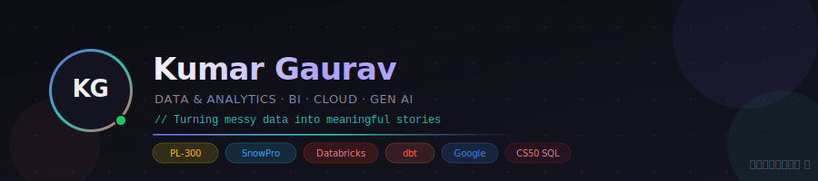

<div align="center">



[](https://iamkumar-gaurav.github.io)

</div>

---

## ⚡ Quick Stats

<div align="center">

| 4+ Years | 6 Certs | 10+ Tools | 3 Cloud Platforms |
|:---:|:---:|:---:|:---:|
| Experience | Earned | Mastered | Deployed on |

</div>

---

## 🎓 Certifications

<div align="center">

| Badge | Certification | Issuer |
|:---:|:---|:---|
| 📊 | **PL-300: Power BI Data Analyst Associate** | Microsoft |
| ❄️ | **SnowPro Core Certification** | Snowflake |
| 🧱 | **Data Engineer Associate** | Databricks |
| 🔧 | **dbt Fundamentals** | Udemy |
| 🌱 | **Google Data Analytics Professional Certificate** | Google |
| 📘 | **CS50 SQL** | Harvard CS50 |

</div>

---

## 🛠️ Tech Stack

**BI & Visualization**


**Data Transformation & Databases**


**Cloud & Data Platforms**


**Languages & Frameworks**


---

## 🚀 What I Do

```text
📊  Build dashboards that simplify complex datasets
🔄  Design data pipelines & transformations for scalable insights
✨  Blend technical rigor with creative storytelling
🤖  Explore GenAI applications in analytics
```

---

## 📊 GitHub Stats

<div align="center">


</div>

---

## 🌐 Connect

<div align="center">

[](https://www.linkedin.com/in/iamkumar-gaurav/)
[](https://iamkumar-gaurav.medium.com/)
[](https://www.youtube.com/@visualizationpractical)
[](https://bsky.app/profile/iamkumar-gaurav.bsky.social)
[](mailto:iamkumar_gaurav@hotmail.com)

</div>

---

<div align="center">

*🌱 Always curious, always learning — currently exploring advanced BI practices and GenAI applications in analytics.*


</div>
